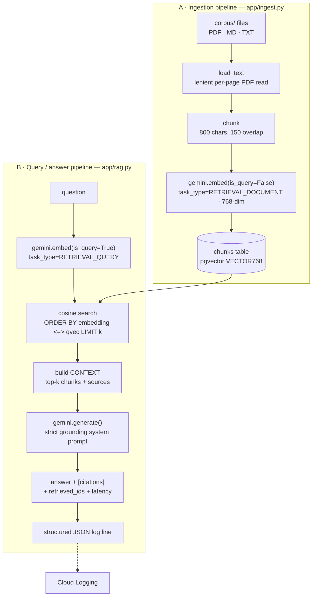

# FieldRAG — Architecture

A ~5-minute read to understand exactly how FieldRAG works. The design is deliberately small: two pipelines (ingest, then query), one vector table, and a strict grounding prompt. Every model ID and knob lives in `app/config.py` so there is a single source of truth.

---

## Full flow



Both pipelines share `app/gemini.py` (the embed/generate wrappers) and `app/db.py` (the connection). The FastAPI layer (`app/api.py`) wraps pipeline B behind `POST /ask` and also serves the single-file demo UI at `GET /`.

---

## A · Ingestion pipeline (`app/ingest.py`)

Turns `corpus/` into rows in the `chunks` table. Run with `python -m app.ingest`.

1. **List ingestible files.** Walk `corpus/` recursively for `.md` / `.txt` / `.pdf`.
2. **Skip what's already there (incremental).** Query the distinct `source` values already in the table; skip any file whose name is present unless `--force` (rebuild all) or `--only NAME` (re-do one) is passed. *Why:* embedding costs an API call per batch — re-running after adding one new doc should embed only that doc, and a run that died halfway can be resumed for free.

   ```python
   cur.execute("SELECT DISTINCT source FROM chunks;")
   existing = {r[0] for r in cur.fetchall()}
   ...
   if name in existing and not force and name != only:
       print(f"  skip {name}: already ingested")
       continue
   ```

3. **Read text leniently.** Markdown/text is read directly. PDFs are read per page with `strict=False` and a per-page `try/except`, so one unreadable page (or a partially damaged file) doesn't discard the whole document.

   ```python
   reader = PdfReader(path, strict=False)
   pages = []
   for pg in reader.pages:
       try:
           pages.append(pg.extract_text() or "")
       except Exception:
           continue  # skip only the unreadable page
   ```

4. **Chunk.** Normalize whitespace, then slide a fixed window of **800 chars with 150 overlap**. *Why overlap:* a fact that straddles a boundary still lands whole inside at least one chunk, so retrieval doesn't split it.

   ```python
   CHUNK_CHARS, OVERLAP = 800, 150
   out, i = [], 0
   while i < len(text):
       out.append(text[i:i + CHUNK_CHARS])
       i += CHUNK_CHARS - OVERLAP
   ```

5. **Embed as documents.** Embed in batches of 32 with `task_type=RETRIEVAL_DOCUMENT` (see below for why the task type matters).
6. **Insert + commit per file.** `ingest_one` first `DELETE`s any existing rows for that `source` (so re-ingest is idempotent), inserts the fresh chunks, and the caller commits **after each file** so progress survives a later failure.

---

## B · Query / answer pipeline (`app/rag.py`)

`retrieve()` then `answer()`. This is what `POST /ask` calls in RAG mode.

1. **Embed the question as a query.** Same model, but `task_type=RETRIEVAL_QUERY`. `gemini-embedding-001` produces *asymmetric* embeddings: encoding queries and documents with their matching task types puts a short question and the passage that answers it close together in vector space. Both sides use `output_dimensionality=768`.

   ```python
   def embed(texts, *, is_query, api_key=None):
       task = "RETRIEVAL_QUERY" if is_query else "RETRIEVAL_DOCUMENT"
       resp = _client_for(api_key).models.embed_content(
           model=config.EMBED_MODEL, contents=texts,
           config=types.EmbedContentConfig(
               task_type=task, output_dimensionality=config.EMBED_DIM),
       )
       return [e.values for e in resp.embeddings]
   ```

   *Why 768-dim:* it keeps the pgvector index small and the cosine scan fast while retaining plenty of retrieval quality for this corpus.

2. **Cosine top-k in pgvector.** `<=>` is pgvector's **cosine-distance** operator; `1 - distance` gives a 0–1 similarity score. Cosine (not L2) because embedding relevance is about direction, not magnitude.

   ```python
   cur.execute(
       "SELECT id, source, content, 1 - (embedding <=> %s::vector) AS score "
       "FROM chunks ORDER BY embedding <=> %s::vector LIMIT %s",
       (qvec, qvec, k),
   )
   ```

3. **Build a CONTEXT block.** Concatenate the top-k chunks, each tagged with its `[source]` filename so the model can cite it.

   ```python
   context = "\n\n".join(f"[{h['source']}]\n{h['content']}" for h in hits)
   prompt = f"CONTEXT:\n{context}\n\nQUESTION: {question}"
   ```

4. **Grounded generation.** Call Gemini with a strict system prompt: answer *only* from CONTEXT, cite the source filename(s), and admit when the answer isn't present. *Why:* this is what makes the output trustworthy for field support and is what the eval's groundedness metric measures.

   ```python
   SYSTEM = (
       "You are a precise technical field-support assistant. "
       "Answer ONLY using the provided CONTEXT. "
       "Cite the source filename(s) you used inline like [source]. "
       "If the answer is not in the context, say you don't have that information. "
       "Be concise."
   )
   ```

5. **Log one structured line.** Every answer emits a single JSON log with the event, a hashed question, latency, retrieved IDs, sources, and token usage. On Cloud Run this goes straight to **Cloud Logging** as a queryable structured entry (the question itself is hashed, not logged verbatim).

   ```python
   log.info(json.dumps({
       "event": "ask", "mode": "rag",
       "q_hash": hashlib.sha1(question.encode()).hexdigest()[:8],
       "latency_ms": result["latency_ms"],
       "retrieved_ids": result["retrieved_ids"],
       "sources": result["citations"],
       **usage,
   }))
   ```

---

## Per-file responsibilities

| File | Role |
|---|---|
| `app/config.py` | Single source of truth; reads env/`.env` for models, `EMBED_DIM`, `TOP_K`, DB creds, and the `REQUIRE_API_KEY_FOR_RAG` / `INSTANCE_CONNECTION_NAME` switches. |
| `app/gemini.py` | Thin `google-genai` wrappers: `embed()` (task-typed, 768-dim) and `generate()` → `(text, usage)`. Supports a per-request BYOK `api_key`. |
| `app/db.py` | One `connect()` that works locally (host:port) and on Cloud SQL (Unix socket); registers pgvector. |
| `app/ingest.py` | corpus → chunk → embed → `chunks` table. Incremental, lenient PDF read, commit-per-file. |
| `app/rag.py` | `retrieve()` (cosine top-k) + `answer()` (grounded generation + structured log). The core RAG path. |
| `app/api.py` | FastAPI: `POST /ask`, `GET /healthz`, and `GET /` (single-file Query Console + Evidence Workspace UI). Enforces BYOK / agent-disabled rules. |
| `app/agent.py` | LangGraph ReAct agent over `search_docs` + `list_sources` tools (multi-step retrieval). |
| `app/eval.py` | Golden-question harness: hit@k, keyword recall, Gemini-as-judge groundedness → `eval/report.json`. |
| `app/mcp_server.py` | Exposes `search_docs` and `ask` as MCP tools over stdio. |
| `schema.sql` | The `chunks` table (`VECTOR(768)`) + the ivfflat cosine index (built after ingest). |

---

## LangGraph agent (2-hop tool use)

`app/agent.py` builds a `create_react_agent` over `ChatVertexAI` (temperature 0) with two tools:

- `search_docs(query)` — semantic search over the corpus (reuses `rag.retrieve`).
- `list_sources()` — lists the distinct source documents.

```python
_llm = ChatVertexAI(model=config.GEN_MODEL, temperature=0)
_agent = create_react_agent(_llm, [search_docs, list_sources])
```

The ReAct loop lets the model call `search_docs` **more than once** for questions that need two lookups (e.g. "compare tool A and tool B"), instead of forcing the user to re-ask. Because it uses server-side Vertex credentials, agent mode is disabled in the free-tier BYOK deployment (`api.py` returns a 400) and is exercised locally with ADC.

## MCP server

`app/mcp_server.py` wraps the same retrieval logic as an **MCP** server (FastMCP over stdio), exposing `search_docs` and `ask` as tools any MCP client (e.g. Claude Desktop) can call. It reuses `app/rag.py` verbatim — the corpus becomes a reusable tool surface, not just an HTTP endpoint.

## Eval harness (3 metrics)

`app/eval.py` reads `eval/golden.jsonl` and, per question, runs the real retrieve + answer path and scores:

1. **Retrieval hit@k** — is `expect_source` among the retrieved chunks' sources? (Binary, averaged.)
2. **Keyword recall** — fraction of `expect_keywords` present in the answer text.
3. **Groundedness** — a separate strict Gemini "judge" rates 1–5 how well the answer is supported by the retrieved context.

```python
JUDGE_SYSTEM = (
    "You are a strict evaluator. Given a QUESTION, the retrieved CONTEXT, and an ANSWER, "
    "rate 1-5 how well the ANSWER is SUPPORTED by the CONTEXT (5 = fully grounded, "
    "1 = unsupported/hallucinated). Reply with ONLY the integer."
)
```

Results are written to `eval/report.json`. Latest (n=10): hit@k **1.0** (10/10), keyword recall **0.692**, groundedness **5.0/5**. Every golden question retrieves its expected source. Keyword recall is a soft lexical proxy — it only checks whether the answer literally contains the expected keyword tokens, so it drops when the model paraphrases (e.g. "duplication" answered as "duplicate reads"), not because of any retrieval or correctness failure; the perfect groundedness score confirms the answers stay fully supported by the retrieved context. (Note: the DRAGEN golden rows were scored against the local-only vendor docs, which aren't redistributed — see `corpus/README.md`.)

## Deployment

- **DB switch (`app/db.py`).** If `INSTANCE_CONNECTION_NAME` is set, connect via the Cloud SQL Unix socket that Cloud Run mounts at `/cloudsql/<INSTANCE_CONNECTION_NAME>` (enabled with `--add-cloudsql-instances`); otherwise connect to `DB_HOST:DB_PORT` (docker-compose). Same code, both environments.

  ```python
  if config.INSTANCE_CONNECTION_NAME:
      conn = psycopg2.connect(
          host=f"/cloudsql/{config.INSTANCE_CONNECTION_NAME}",
          dbname=config.DB_NAME, user=config.DB_USER, password=config.DB_PASSWORD)
  else:
      conn = psycopg2.connect(
          host=config.DB_HOST, port=config.DB_PORT,
          dbname=config.DB_NAME, user=config.DB_USER, password=config.DB_PASSWORD)
  ```

- **Cloud Run.** The `Dockerfile` runs `uvicorn app.api:app` on `$PORT`. Structured logs land in Cloud Logging automatically.
- **BYOK vs Vertex.** In the public deployment (`REQUIRE_API_KEY_FOR_RAG=true`), RAG uses the visitor's own Gemini key for that one request (never stored/logged), routing through the Gemini Developer API free tier; agent mode requires server-side Vertex creds and is therefore disabled there. Locally, ADC (or a server-side `GEMINI_API_KEY`) drives both.
