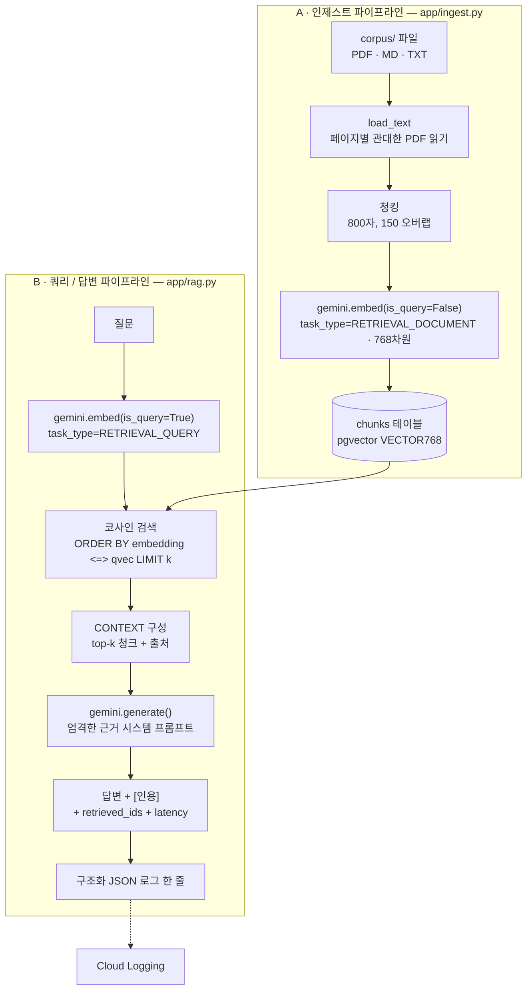

# FieldRAG — 아키텍처

FieldRAG가 정확히 어떻게 동작하는지 약 5분 안에 이해할 수 있는 문서입니다. 설계는 의도적으로 작습니다: 두 개의 파이프라인(인제스트, 그다음 쿼리), 하나의 벡터 테이블, 하나의 엄격한 근거(grounding) 프롬프트. 모든 모델 ID와 설정값은 `app/config.py`에 있어 단일 진실 공급원(single source of truth)을 이룹니다.

---

## 전체 흐름



두 파이프라인 모두 `app/gemini.py`(embed/generate 래퍼)와 `app/db.py`(연결)를 공유합니다. FastAPI 계층(`app/api.py`)은 파이프라인 B를 `POST /ask` 뒤에 감싸고, `GET /`에서 단일 파일 데모 UI도 제공합니다.

---

## A · 인제스트 파이프라인 (`app/ingest.py`)

`corpus/`를 `chunks` 테이블의 행으로 변환합니다. `python -m app.ingest`로 실행.

1. **인제스트 대상 파일 목록화.** `corpus/`를 재귀적으로 훑어 `.md` / `.txt` / `.pdf`를 찾습니다.
2. **이미 있는 것은 건너뛰기 (증분).** 테이블에 이미 존재하는 distinct `source` 값을 조회하고, 이름이 존재하는 파일은 건너뜁니다 — `--force`(전체 재구축)나 `--only NAME`(하나만 다시)이 지정되지 않는 한. *이유:* 임베딩은 배치마다 API 호출 비용이 듭니다. 새 문서 하나를 추가한 뒤 재실행하면 그 문서만 임베딩해야 하고, 중간에 죽은 실행은 무료로 이어서 할 수 있어야 합니다.

   ```python
   cur.execute("SELECT DISTINCT source FROM chunks;")
   existing = {r[0] for r in cur.fetchall()}
   ...
   if name in existing and not force and name != only:
       print(f"  skip {name}: already ingested")
       continue
   ```

3. **텍스트를 관대하게 읽기.** Markdown/텍스트는 그대로 읽습니다. PDF는 `strict=False`와 페이지별 `try/except`로 읽어, 읽을 수 없는 페이지 하나(또는 일부 손상된 파일)가 문서 전체를 버리지 않게 합니다.

   ```python
   reader = PdfReader(path, strict=False)
   pages = []
   for pg in reader.pages:
       try:
           pages.append(pg.extract_text() or "")
       except Exception:
           continue  # 읽을 수 없는 페이지만 건너뜀
   ```

4. **청킹.** 공백을 정규화한 뒤 **800자, 150 오버랩**의 고정 창을 슬라이드합니다. *오버랩 이유:* 경계에 걸친 사실도 최소 한 청크 안에는 온전히 담기므로, 검색이 그 사실을 쪼개지 않습니다.

   ```python
   CHUNK_CHARS, OVERLAP = 800, 150
   out, i = [], 0
   while i < len(text):
       out.append(text[i:i + CHUNK_CHARS])
       i += CHUNK_CHARS - OVERLAP
   ```

5. **문서로 임베딩.** `task_type=RETRIEVAL_DOCUMENT`로 32개씩 배치 임베딩합니다(태스크 타입이 왜 중요한지는 아래 참고).
6. **삽입 + 파일별 커밋.** `ingest_one`은 해당 `source`의 기존 행을 먼저 `DELETE`하고(재인제스트 멱등성 확보), 새 청크를 삽입하며, 호출부는 **파일마다** 커밋해 이후 실패에도 진행 상황이 남게 합니다.

---

## B · 쿼리 / 답변 파이프라인 (`app/rag.py`)

`retrieve()` 다음 `answer()`. RAG 모드에서 `POST /ask`가 호출하는 경로입니다.

1. **질문을 쿼리로 임베딩.** 같은 모델이지만 `task_type=RETRIEVAL_QUERY`. `gemini-embedding-001`은 *비대칭* 임베딩을 만듭니다: 쿼리와 문서를 각각의 태스크 타입으로 인코딩하면 짧은 질문과 그에 답하는 구절이 벡터 공간에서 가까워집니다. 양쪽 모두 `output_dimensionality=768`.

   ```python
   def embed(texts, *, is_query, api_key=None):
       task = "RETRIEVAL_QUERY" if is_query else "RETRIEVAL_DOCUMENT"
       resp = _client_for(api_key).models.embed_content(
           model=config.EMBED_MODEL, contents=texts,
           config=types.EmbedContentConfig(
               task_type=task, output_dimensionality=config.EMBED_DIM),
       )
       return [e.values for e in resp.embeddings]
   ```

   *768차원 이유:* pgvector 인덱스를 작게, 코사인 스캔을 빠르게 유지하면서도 이 코퍼스에 충분한 검색 품질을 남깁니다.

2. **pgvector에서 코사인 top-k.** `<=>`는 pgvector의 **코사인 거리** 연산자이며, `1 - distance`가 0–1 유사도 점수를 줍니다. 임베딩의 관련성은 크기가 아니라 방향의 문제이므로 L2가 아닌 코사인을 씁니다.

   ```python
   cur.execute(
       "SELECT id, source, content, 1 - (embedding <=> %s::vector) AS score "
       "FROM chunks ORDER BY embedding <=> %s::vector LIMIT %s",
       (qvec, qvec, k),
   )
   ```

3. **CONTEXT 블록 구성.** top-k 청크를 이어붙이되 각 청크에 `[source]` 파일명을 태깅해 모델이 인용할 수 있게 합니다.

   ```python
   context = "\n\n".join(f"[{h['source']}]\n{h['content']}" for h in hits)
   prompt = f"CONTEXT:\n{context}\n\nQUESTION: {question}"
   ```

4. **근거 기반 생성.** 엄격한 시스템 프롬프트로 Gemini를 호출합니다: CONTEXT에서만 답하고, 출처 파일명을 인용하며, 답이 없으면 없다고 인정할 것. *이유:* 이것이 필드 지원용으로 신뢰할 수 있는 출력을 만들며, 평가의 근거성 지표가 측정하는 대상입니다.

   ```python
   SYSTEM = (
       "You are a precise technical field-support assistant. "
       "Answer ONLY using the provided CONTEXT. "
       "Cite the source filename(s) you used inline like [source]. "
       "If the answer is not in the context, say you don't have that information. "
       "Be concise."
   )
   ```

5. **구조화 로그 한 줄 기록.** 모든 답변은 이벤트, 해시된 질문, 지연시간, 검색된 ID, 출처, 토큰 사용량을 담은 JSON 로그 한 줄을 남깁니다. Cloud Run에서는 이것이 조회 가능한 구조화 엔트리로 **Cloud Logging**에 바로 들어갑니다(질문 원문은 그대로 남기지 않고 해시합니다).

   ```python
   log.info(json.dumps({
       "event": "ask", "mode": "rag",
       "q_hash": hashlib.sha1(question.encode()).hexdigest()[:8],
       "latency_ms": result["latency_ms"],
       "retrieved_ids": result["retrieved_ids"],
       "sources": result["citations"],
       **usage,
   }))
   ```

---

## 파일별 역할

| 파일 | 역할 |
|---|---|
| `app/config.py` | 단일 진실 공급원. env/`.env`에서 모델, `EMBED_DIM`, `TOP_K`, DB 자격 증명, `REQUIRE_API_KEY_FOR_RAG` / `INSTANCE_CONNECTION_NAME` 스위치를 읽음. |
| `app/gemini.py` | 얇은 `google-genai` 래퍼: `embed()`(태스크 타입 지정, 768차원)와 `generate()` → `(text, usage)`. 요청별 BYOK `api_key` 지원. |
| `app/db.py` | 로컬(host:port)과 Cloud SQL(Unix 소켓)에서 모두 동작하는 하나의 `connect()`; pgvector 등록. |
| `app/ingest.py` | corpus → 청킹 → 임베딩 → `chunks` 테이블. 증분, 관대한 PDF 읽기, 파일별 커밋. |
| `app/rag.py` | `retrieve()`(코사인 top-k) + `answer()`(근거 기반 생성 + 구조화 로그). 핵심 RAG 경로. |
| `app/api.py` | FastAPI: `POST /ask`, `GET /healthz`, `GET /`(단일 파일 Query Console + Evidence Workspace UI). BYOK / 에이전트 비활성화 규칙 적용. |
| `app/agent.py` | `search_docs` + `list_sources` 도구를 쓰는 LangGraph ReAct 에이전트(멀티 스텝 검색). |
| `app/eval.py` | 골든 질문 하네스: hit@k, 키워드 재현율, Gemini-as-judge 근거성 → `eval/report.json`. |
| `app/mcp_server.py` | `search_docs`와 `ask`를 stdio 기반 MCP 도구로 노출. |
| `schema.sql` | `chunks` 테이블(`VECTOR(768)`) + ivfflat 코사인 인덱스(인제스트 후 생성). |

---

## LangGraph 에이전트 (2-hop 도구 사용)

`app/agent.py`는 `ChatVertexAI`(temperature 0) 위에 두 개의 도구로 `create_react_agent`를 구성합니다:

- `search_docs(query)` — 코퍼스에 대한 시맨틱 검색(`rag.retrieve` 재사용).
- `list_sources()` — distinct 출처 문서 목록화.

```python
_llm = ChatVertexAI(model=config.GEN_MODEL, temperature=0)
_agent = create_react_agent(_llm, [search_docs, list_sources])
```

ReAct 루프는 두 번의 조회가 필요한 질문(예: "도구 A와 B 비교")에서 모델이 `search_docs`를 **여러 번** 호출하게 해, 사용자가 다시 물어볼 필요를 없앱니다. 서버측 Vertex 자격 증명을 쓰기 때문에 무료 티어 BYOK 배포에서는 에이전트 모드가 비활성화되며(`api.py`가 400 반환) 로컬에서 ADC로 실행됩니다.

## MCP 서버

`app/mcp_server.py`는 동일한 검색 로직을 **MCP** 서버(stdio 기반 FastMCP)로 감싸 `search_docs`와 `ask`를 어떤 MCP 클라이언트(예: Claude Desktop)든 호출할 수 있는 도구로 노출합니다. `app/rag.py`를 그대로 재사용하므로, 코퍼스가 HTTP 엔드포인트뿐 아니라 재사용 가능한 도구 표면이 됩니다.

## 평가 하네스 (3개 지표)

`app/eval.py`는 `eval/golden.jsonl`을 읽어 질문마다 실제 검색 + 답변 경로를 실행하고 채점합니다:

1. **검색 hit@k** — `expect_source`가 검색된 청크의 출처에 있는가? (이진, 평균.)
2. **키워드 재현율** — `expect_keywords` 중 답변 텍스트에 등장한 비율.
3. **근거성** — 별도의 엄격한 Gemini "judge"가 답변이 검색된 컨텍스트로 얼마나 뒷받침되는지 1–5로 채점.

```python
JUDGE_SYSTEM = (
    "You are a strict evaluator. Given a QUESTION, the retrieved CONTEXT, and an ANSWER, "
    "rate 1-5 how well the ANSWER is SUPPORTED by the CONTEXT (5 = fully grounded, "
    "1 = unsupported/hallucinated). Reply with ONLY the integer."
)
```

결과는 `eval/report.json`에 기록됩니다. 최신(n=10): hit@k **1.0** (10/10), 키워드 재현율 **0.692**, 근거성 **5.0/5**. 모든 골든 질문이 기대 출처를 검색합니다. 키워드 재현율은 느슨한 어휘 프록시로, 답변에 기대 키워드 토큰이 문자 그대로 들어있는지만 확인하므로 모델이 바꿔 표현하면(예: "duplication"을 "duplicate reads"로 답변) 낮아집니다 — 검색이나 정확성 실패가 아닙니다. 완벽한 근거성 점수가 답변이 검색된 컨텍스트로 온전히 뒷받침됨을 확인해 줍니다. (참고: DRAGEN 골든 행은 재배포되지 않는 로컬 전용 벤더 문서로 채점되었습니다 — `corpus/README.md` 참고.)

## 배포

- **DB 스위치 (`app/db.py`).** `INSTANCE_CONNECTION_NAME`이 설정되면 Cloud Run이 `/cloudsql/<INSTANCE_CONNECTION_NAME>`에 마운트하는 Cloud SQL Unix 소켓으로 연결하고(`--add-cloudsql-instances`로 활성화), 아니면 `DB_HOST:DB_PORT`(docker-compose)로 연결합니다. 같은 코드, 두 환경.

  ```python
  if config.INSTANCE_CONNECTION_NAME:
      conn = psycopg2.connect(
          host=f"/cloudsql/{config.INSTANCE_CONNECTION_NAME}",
          dbname=config.DB_NAME, user=config.DB_USER, password=config.DB_PASSWORD)
  else:
      conn = psycopg2.connect(
          host=config.DB_HOST, port=config.DB_PORT,
          dbname=config.DB_NAME, user=config.DB_USER, password=config.DB_PASSWORD)
  ```

- **Cloud Run.** `Dockerfile`이 `$PORT`에서 `uvicorn app.api:app`를 실행합니다. 구조화 로그는 자동으로 Cloud Logging에 들어갑니다.
- **BYOK vs Vertex.** 공개 배포(`REQUIRE_API_KEY_FOR_RAG=true`)에서 RAG는 방문자 본인의 Gemini 키를 그 한 요청에만 사용하며(저장/로그 안 함) Gemini Developer API 무료 티어로 라우팅합니다. 에이전트 모드는 서버측 Vertex 자격 증명이 필요해 그곳에서는 비활성화됩니다. 로컬에서는 ADC(또는 서버측 `GEMINI_API_KEY`)가 둘 다 구동합니다.
