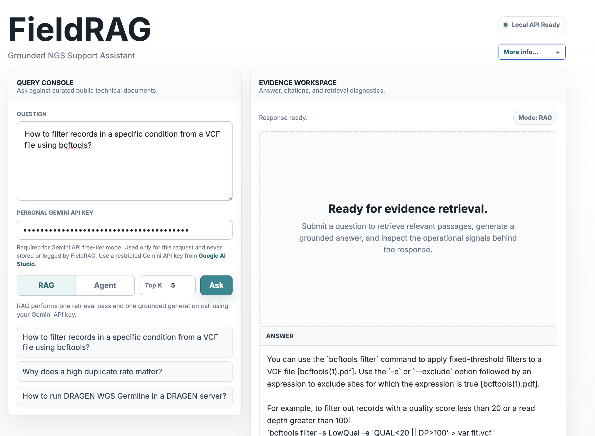
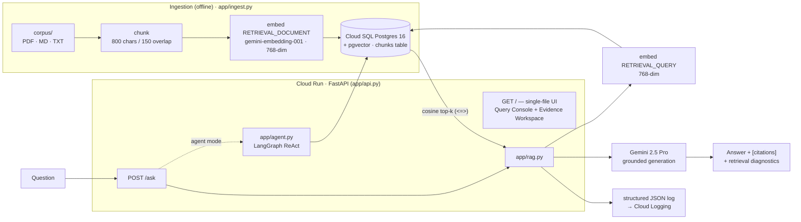

# FieldRAG

A grounded RAG + agent assistant for NGS / bioinformatics field support, built entirely on the **Google-native** stack: **Gemini 2.5 Pro** + `gemini-embedding-001` (via the `google-genai` SDK), **pgvector** on **Cloud SQL for PostgreSQL**, and **FastAPI** on **Cloud Run** — with a **LangGraph** ReAct agent, an optional **MCP** server, an **LLM-judge evaluation harness**, and structured JSON logs flowing to **Cloud Logging**.



**Live demo:** deployed to Cloud Run at `https://fieldrag-417730771960.asia-northeast3.run.app`, currently **offline to keep cloud cost at zero** — Cloud Run scales to zero when idle, but Cloud SQL bills even while idle, so the deployment was taken down. It can be brought back live on demand (see [Cost & lifecycle](#cost--lifecycle)). The screenshot above is the running app answering a `bcftools` question with a grounded, cited answer.

> A domain-authentic demonstration of a grounded RAG system: a field engineer asks a natural-language question and gets a **concise, cited answer** synthesized by Gemini strictly from a curated corpus of public NGS/bioinformatics docs — retrieved by semantic search over a vector database, with the retrieval evidence (citations, latency, retrieved chunk IDs, raw JSON) shown alongside the answer.

---

## Architecture



**Two runtimes, one codebase.** `app/db.py` connects to a docker-compose Postgres locally and to Cloud SQL via the `/cloudsql/<INSTANCE_CONNECTION_NAME>` Unix socket in production — it switches automatically on whether `INSTANCE_CONNECTION_NAME` is set. Nothing else changes between local and cloud.

For the step-by-step implementation walkthrough (both pipelines, real code snippets, the per-file map), see **[ARCHITECTURE.md](ARCHITECTURE.md)**.

---

## Evaluation

`app/eval.py` runs each golden question through the real retrieval + answer path, then scores three metrics. Latest run (`eval/report.json`, n=10):

| Metric | Result | What it measures |
|---|---|---|
| Retrieval hit@k | **1.0** (10/10) | Was the expected source document in the top-k retrieved chunks? |
| Keyword recall | **0.692** | Fraction of expected keyword tokens literally present in the generated answer. |
| Groundedness (Gemini-as-judge) | **5.0 / 5** | A strict Gemini evaluator rates how fully the answer is supported by the retrieved context (1–5). |

All 10 golden questions retrieve their expected source (hit@k 1.0). Keyword recall (0.692) is a deliberately **soft lexical proxy** — it only checks whether the answer literally contains the expected keyword tokens, so it drops naturally when the model paraphrases (e.g. answering "duplication" as "duplicate reads"), not because retrieval or the answer is wrong. Groundedness staying a perfect 5.0 confirms every answer remains fully supported by the retrieved context.

---

## What it demonstrates

| Capability | Where |
|---|---|
| Python software development | whole repo |
| AI-driven solution deployed on GCP | Cloud Run + Cloud SQL + Gemini (Vertex / Gemini API) |
| Data pipeline w/ vector DB + RAG | `app/ingest.py` → pgvector → `app/rag.py` |
| Multi-agent / LangGraph | `app/agent.py` (ReAct, 2-hop tool use) |
| MCP servers | `app/mcp_server.py` |
| Evaluation pipelines / LLM-native metrics | `app/eval.py` |
| Observability frameworks | structured JSON logs → Cloud Logging (`app/rag.py`) |

---

## Quick start (local)

```bash
python3 -m venv .venv && source .venv/bin/activate
pip install -r requirements.txt
cp .env.example .env
# Pick one Gemini auth path for ingest/eval:
#   1) set GEMINI_API_KEY in .env (Gemini Developer API), or
#   2) set GOOGLE_CLOUD_PROJECT and run: gcloud auth application-default login

docker compose up -d                                              # local pgvector Postgres 16
docker compose exec -T db psql -U fieldrag -d fieldrag < schema.sql
python -m app.ingest                                              # chunk + embed corpus/ → pgvector
uvicorn app.api:app --reload                                      # open http://localhost:8000
python -m app.eval                                                # writes eval/report.json
```

`python -m app.ingest` is **incremental** — it skips documents already in the `chunks` table (matched by filename), so re-running only ingests newly added or previously failed files. Use `--force` to rebuild everything, or `--only NAME` to re-ingest a single file.

---

## Corpus

This public repo commits **open-source documentation only**:

| Document | Source / license |
|---|---|
| `samtools(1) manual page.pdf` | samtools man page — MIT (htslib project) |
| `bcftools(1).pdf` | bcftools man page — MIT (htslib project) |
| `nextflow_document.pdf` | Nextflow documentation |
| `nfcore_document.pdf` | nf-core community pipeline docs — MIT |
| `NGS_duplication_rate.md` | author-written explainer |
| `sample_ngs_qc.md` | author-written sample QC notes |

The local evaluation corpus also included Illumina **DRAGEN** (`dragen_v4_5_document.pdf`) and **Connected Insights** vendor docs. Those are **proprietary and not redistributable**, so they are gitignored and excluded here. `eval/golden.jsonl` and `eval/report.json` still reference DRAGEN questions because they were evaluated locally — a fresh clone therefore reproduces only the open-source subset (the DRAGEN rows won't retrieve). See **[corpus/README.md](corpus/README.md)** for details and how to add your own public docs.

---

## Security / BYOK

- **Secrets:** in a real deployment `DB_PASSWORD` (and any server-side `GEMINI_API_KEY`) come from **Secret Manager** (`gcloud run deploy --set-secrets`), never from `--set-env-vars`. No keys are committed.
- **BYOK (bring your own key):** the public deployment runs with `REQUIRE_API_KEY_FOR_RAG=true`. For RAG mode the visitor pastes their **own** Gemini API key in the UI; the backend uses it for that **single request only** and never stores or logs it. This routes Gemini 2.5 Pro through the Gemini Developer API free tier instead of server-side Vertex billing.
- **Agent mode** uses server-side Vertex / LangGraph credentials, so it is **disabled** in the free-tier BYOK deployment. It works locally with ADC.

---

## Docs

- **[ARCHITECTURE.md](ARCHITECTURE.md)** — implementation walkthrough: ingestion & query pipelines, code snippets, per-file map. ([한국어](ARCHITECTURE_KR.md))
- **[PRD.md](PRD.md)** — project overview: goals, scope, design decisions.
- **[TRD.md](TRD.md)** — technical design & stack rationale.
- **[GUIDE.md](GUIDE.md)** — build & deploy guide (run it end to end).
- **[README_KR.md](README_KR.md)** — Korean edition of this page.

---

## Cost & lifecycle

The live deployment is currently **offline to keep cloud cost at zero**. Cloud Run scales to zero when idle, but Cloud SQL bills even while idle — so the deployment was taken down and can be restored on demand. See **[GUIDE.md](GUIDE.md)** STEP 15–16 for the exact take-offline and bring-back-live commands.
