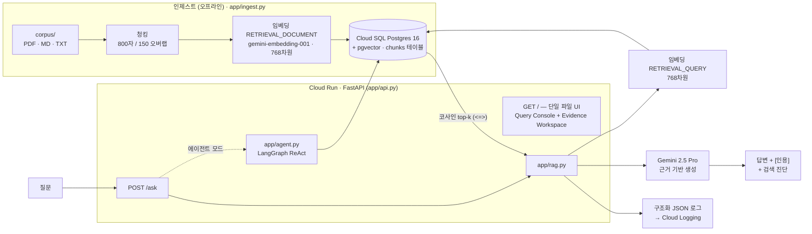

# FieldRAG

NGS / 생명정보 필드 지원을 위한 근거 기반 RAG + 에이전트 어시스턴트. 전체가 **Google 네이티브** 스택으로 구축되었습니다: `google-genai` SDK를 통한 **Gemini 2.5 Pro** + `gemini-embedding-001`, **Cloud SQL for PostgreSQL** 위의 **pgvector**, **Cloud Run** 위의 **FastAPI** — 여기에 **LangGraph** ReAct 에이전트, 선택적 **MCP** 서버, **LLM-judge 평가 하네스**, 그리고 **Cloud Logging**으로 흐르는 구조화 JSON 로그가 더해집니다.

**▶ 라이브 데모: https://fieldrag-417730771960.asia-northeast3.run.app**

> 근거 기반 RAG 시스템을 도메인에 맞게 실증하는 프로젝트입니다. 필드 엔지니어가 자연어로 질문하면, Gemini가 공개 NGS/생명정보 문서 코퍼스에서만 근거를 찾아 **간결하고 출처가 인용된 답변**을 합성해 줍니다. 벡터 DB에 대한 시맨틱 검색으로 문서를 찾고, 검색 근거(인용, 지연시간, 검색된 청크 ID, raw JSON)를 답변과 함께 보여 줍니다.

---

## 아키텍처



**두 런타임, 하나의 코드베이스.** `app/db.py`는 로컬에서는 docker-compose Postgres에, 프로덕션에서는 `/cloudsql/<INSTANCE_CONNECTION_NAME>` Unix 소켓을 통해 Cloud SQL에 연결합니다 — `INSTANCE_CONNECTION_NAME` 설정 여부만으로 자동 전환됩니다. 그 외에는 로컬과 클라우드가 완전히 동일합니다.

구현 상세(두 파이프라인, 실제 코드 스니펫, 파일별 역할)는 **[ARCHITECTURE_KR.md](ARCHITECTURE_KR.md)** 참고.

---

## 평가

`app/eval.py`는 각 골든 질문을 실제 검색 + 답변 경로로 실행한 뒤 세 가지 지표를 측정합니다. 최신 실행 (`eval/report.json`, n=10):

| 지표 | 결과 | 측정 대상 |
|---|---|---|
| 검색 hit@k | **1.0** (10/10) | 기대 출처 문서가 top-k 검색 청크에 포함되었는가? |
| 키워드 재현율 | **0.692** | 생성된 답변에 기대 키워드 토큰이 문자 그대로 포함된 비율. |
| 근거성 (Gemini-as-judge) | **5.0 / 5** | 엄격한 Gemini 평가자가 답변이 검색된 컨텍스트로 얼마나 뒷받침되는지 1–5로 채점. |

10개 골든 질문 모두 기대 출처를 검색합니다(hit@k 1.0). 키워드 재현율(0.692)은 의도적으로 **느슨한 어휘 프록시**입니다 — 답변에 기대 키워드 토큰이 문자 그대로 들어있는지만 확인하므로, 모델이 바꿔 표현하면(예: "duplication"을 "duplicate reads"로 답변) 자연스럽게 낮아집니다. 검색이나 답변이 틀려서가 아닙니다. 근거성이 완벽한 5.0을 유지한다는 점이 모든 답변이 검색된 컨텍스트로 온전히 뒷받침됨을 확인해 줍니다.

---

## 무엇을 입증하나

| 기능 | 위치 |
|---|---|
| Python 소프트웨어 개발 | 저장소 전체 |
| GCP에 배포된 AI 기반 솔루션 | Cloud Run + Cloud SQL + Gemini (Vertex / Gemini API) |
| 벡터 DB + RAG 데이터 파이프라인 | `app/ingest.py` → pgvector → `app/rag.py` |
| 멀티 에이전트 / LangGraph | `app/agent.py` (ReAct, 2-hop 도구 사용) |
| MCP 서버 | `app/mcp_server.py` |
| 평가 파이프라인 / LLM-native 지표 | `app/eval.py` |
| 관측성 프레임워크 | 구조화 JSON 로그 → Cloud Logging (`app/rag.py`) |

---

## 빠른 시작 (로컬)

```bash
python3 -m venv .venv && source .venv/bin/activate
pip install -r requirements.txt
cp .env.example .env
# 인제스트/평가용 Gemini 인증 경로 중 하나 선택:
#   1) .env에 GEMINI_API_KEY 설정 (Gemini Developer API), 또는
#   2) GOOGLE_CLOUD_PROJECT 설정 후: gcloud auth application-default login

docker compose up -d                                              # 로컬 pgvector Postgres 16
docker compose exec -T db psql -U fieldrag -d fieldrag < schema.sql
python -m app.ingest                                              # corpus/ 청킹 + 임베딩 → pgvector
uvicorn app.api:app --reload                                      # http://localhost:8000 열기
python -m app.eval                                                # eval/report.json 생성
```

`python -m app.ingest`는 **증분(incremental)** 방식입니다 — `chunks` 테이블에 이미 있는 문서(파일명 기준)는 건너뛰므로, 재실행 시 새로 추가되거나 이전에 실패한 파일만 인제스트합니다. 전체 재구축은 `--force`, 단일 파일 재인제스트는 `--only NAME`을 사용하세요.

---

## 코퍼스

이 공개 저장소에는 **오픈소스 문서만** 커밋되어 있습니다:

| 문서 | 출처 / 라이선스 |
|---|---|
| `samtools(1) manual page.pdf` | samtools man page — MIT (htslib 프로젝트) |
| `bcftools(1).pdf` | bcftools man page — MIT (htslib 프로젝트) |
| `nextflow_document.pdf` | Nextflow 문서 |
| `nfcore_document.pdf` | nf-core 커뮤니티 파이프라인 문서 — MIT |
| `NGS_duplication_rate.md` | 저자 작성 해설 |
| `sample_ngs_qc.md` | 저자 작성 샘플 QC 노트 |

로컬 평가 코퍼스에는 Illumina **DRAGEN** (`dragen_v4_5_document.pdf`)과 **Connected Insights** 벤더 문서도 포함되어 있었습니다. 이들은 **독점 자료라 재배포 불가**이므로 gitignore 처리되어 여기서 제외됩니다. `eval/golden.jsonl`과 `eval/report.json`은 로컬에서 평가했기 때문에 여전히 DRAGEN 질문을 참조합니다 — 따라서 새로 클론하면 오픈소스 부분집합만 재현됩니다(DRAGEN 행은 검색되지 않음). 상세 내용과 자신의 공개 문서를 추가하는 방법은 **[corpus/README.md](corpus/README.md)** 참고.

---

## 보안 / BYOK

- **시크릿:** 실제 배포에서 `DB_PASSWORD`(및 서버측 `GEMINI_API_KEY`)는 `--set-env-vars`가 아니라 **Secret Manager**(`gcloud run deploy --set-secrets`)에서 가져옵니다. 저장소에 키는 커밋하지 않습니다.
- **BYOK(bring your own key):** 공개 배포는 `REQUIRE_API_KEY_FOR_RAG=true`로 실행됩니다. RAG 모드에서 방문자는 **자신의** Gemini API 키를 UI에 붙여넣고, 백엔드는 그 키를 **해당 요청 한 번만** 사용하며 저장하거나 로그에 남기지 않습니다. 이렇게 하면 Gemini 2.5 Pro가 서버측 Vertex 과금 대신 Gemini Developer API 무료 티어로 라우팅됩니다.
- **에이전트 모드**는 서버측 Vertex / LangGraph 자격 증명을 사용하므로 무료 티어 BYOK 배포에서는 **비활성화**됩니다. 로컬에서는 ADC로 동작합니다.

---

## 문서

- **[ARCHITECTURE_KR.md](ARCHITECTURE_KR.md)** — 구현 상세: 인제스트 & 쿼리 파이프라인, 코드 스니펫, 파일별 역할. ([English](ARCHITECTURE.md))
- **[PRD_KR.md](PRD_KR.md)** — 프로젝트 개요: 목표·범위·설계 결정.
- **[TRD_KR.md](TRD_KR.md)** — 기술 설계 & 스택 근거.
- **[GUIDE_KR.md](GUIDE_KR.md)** — 빌드 & 배포 가이드 (처음부터 끝까지 실행).
- **[README.md](README.md)** — 이 페이지의 영문판.

---

## 비용 & 라이프사이클

위 데모는 현재 **라이브**입니다. Cloud Run은 유휴 시 0으로 스케일다운되지만 Cloud SQL은 유휴 상태에서도 과금됩니다 — 따라서 이 배포는 (데이터베이스를 삭제하거나 일시정지하여) **클라우드 비용 0**으로 내렸다가 필요할 때 다시 복구할 수 있습니다. 오프라인 전환과 재가동 명령의 정확한 내용은 **[GUIDE_KR.md](GUIDE_KR.md)** STEP 15–16을 참고하세요.
